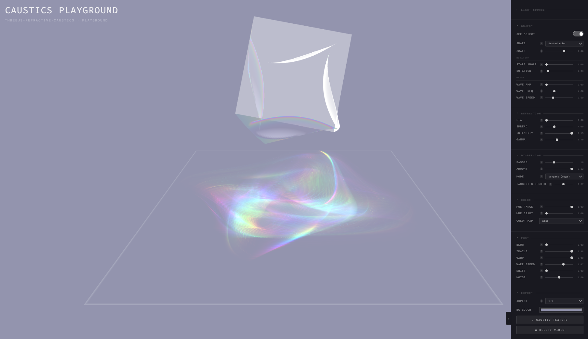

# threejs-refractive-caustics

Stylised real-time caustic light patterns for Three.js, cast from any refractive mesh onto any surface in your scene. With chromatic dispersion, motion trails, blur, UV warp, and many more parameters to shape the look of your physics-inspired caustic projections.


🔗 [Live playground](https://axlindt.github.io/threejs-refractive-caustics) · try all parameters with interactive sliders

🔗 [Gallery example](https://axlindt.github.io/threejs-refractive-caustics/gallery/) · walkable three-room scene with caustics as architectural lighting

[](https://axlindt.github.io/threejs-refractive-caustics)

---

## What this is

A drop-in library for rendering stylised caustics in Three.js. Caustics are the bright, shifting light patterns you see when light passes through glass or water. Rather than aiming for physical accuracy, this library focuses on making caustics look beautiful and expressive: chromatic dispersion, motion trails, UV warp, and other post-effects let you shape the look to fit your scene.

Most WebGL caustics implementations are tied to flat water planes. This library works with any caster mesh (torus knots, glass sculptures, lenses, curved surfaces), which opens caustics up as a general-purpose lighting and visual effect in your Three.js project.

You can design your caustics and tweak all settings interactively in the [playground](https://axlindt.github.io/threejs-refractive-caustics), and export screenshots and videos from there too.

This repo provides:

- **`CausticProjector`** : the main API. Create one, register a caster and receivers, call `update()` each frame.
- **N-pass chromatic dispersion** : smooth rainbow caustics by running the refraction pipeline multiple times with varying IOR and hue.
- **Post-processing controls** : motion trails, gaussian blur, UV warp, flicker, gamma, and vertex wave animation.
- **9 built-in procedural geometries** : torus knot, lens, wave sheet, möbius, gyroid, wobbly bubble, ribbon, ripple disc, dented cube.
- **An interactive playground** : all parameters exposed as sliders, live PNG and video export.
- **A gallery example** : a walkable three-room scene using multiple caustic projectors as architectural lighting.

---

## Install

```bash
npm install threejs-refractive-caustics
# peer dependency
npm install three
```

Or clone and import directly from the repo root (`index.js`).

## Quick start

```js
import * as THREE from 'three'
import { CausticProjector, geometries } from 'threejs-refractive-caustics'

const renderer = new THREE.WebGLRenderer({ antialias: true })
renderer.setSize(window.innerWidth, window.innerHeight)
document.body.appendChild(renderer.domElement)

const scene  = new THREE.Scene()
const camera = new THREE.PerspectiveCamera(50, window.innerWidth / window.innerHeight, 0.1, 100)
camera.position.set(0, 4, 6)
camera.lookAt(0, 0, 0)

const clock = new THREE.Clock()

// 1. Create the caustic projector
const projector = new CausticProjector(renderer, {
  eta:       0.75,   // refractive index, lower bends more
  passes:    16,     // dispersion pass count
  intensity: 0.02,
  hueRange:  1.0,    // full rainbow spectrum
})

// 2. The caster: a refractive glass object that light passes through
//    Use any geometry you like, or one of the 9 built-in shapes
const glassMat = new THREE.MeshPhysicalMaterial({
  transmission: 1, roughness: 0, thickness: 1.5,
})
const glass = new THREE.Mesh(geometries['torus knot'](), glassMat)
glass.position.y = 2
projector.addCaster(glass)

// 3. The receiver: any surface that catches the projected light
//    Multiple receivers are supported, call addReceiver for each
const floor = new THREE.Mesh(
  new THREE.PlaneGeometry(10, 10),
  new THREE.MeshStandardMaterial({ color: 0x888888 })
)
floor.rotation.x = -Math.PI / 2
projector.addReceiver(floor)

scene.add(glass, floor)

// 4. Update every frame before rendering
const lightPos = new THREE.Vector3(0, 8, 0)
const lightDir = new THREE.Vector3(0, -1, 0)

function animate() {
  requestAnimationFrame(animate)
  projector.update(lightPos, lightDir, clock.getElapsedTime())
  renderer.render(scene, camera)
}
animate()
```

---

## Configurations

All configurations are optional and can be changed at runtime via `projector.set(key, value)`.

### Refraction

| option | default | description |
|---|---|---|
| `eta` | `0.75` | refractive index; lower bends more |
| `spread` | `4.0` | how far refracted rays travel; also controls defocus |
| `intensity` | `0.02` | linear brightness multiplier |

### Dispersion

| option | default | description |
|---|---|---|
| `passes` | `16` | dispersion pass count; more passes = smoother rainbow |
| `dispersion` | `0.04` | IOR variation across passes; controls colour separation width |
| `hueRange` | `0.5` | `0` = monochrome, `1` = full spectrum across passes |
| `hueStart` | `0.0` | rotates the starting hue of the spectrum |
| `dispersionMode` | `0` | `0` = radial (by bend angle), `1` = tangent (edge-aligned) |
| `tangentStrength` | `0.3` | strength of tangent-mode colour shift |

### Post-processing

| option | default | description |
|---|---|---|
| `gamma` | `1.0` | contrast curve; `>1` punchy hotspots, `<1` softer |
| `trails` | `0.6` | temporal blend; `0` = sharp, `0.98` = long motion trails |
| `blur` | `1.5` | separable gaussian blur radius |
| `warp` | `0.0` | animated UV noise distortion amount |
| `warpSpeed` | `0.2` | speed of warp noise animation |
| `flicker` | `0.0` | spatially-varying Perlin brightness modulation |

### Waves (caster vertex animation)

| option | default | description |
|---|---|---|
| `waveAmp` | `0.0` | wave displacement amplitude on the caster |
| `waveFreq` | `4.0` | spatial frequency of the wave pattern |
| `waveSpeed` | `0.5` | animation speed of the wave pattern |

### Resolution

| option | default | description |
|---|---|---|
| `envSize` | `2048` | env map render target resolution |
| `causticSize` | `2048` | caustic texture resolution |

---

## API

### `new CausticProjector(renderer, options?)`

Creates the projector. `renderer` must be a `THREE.WebGLRenderer`.

### `projector.addCaster(mesh)`

Registers a mesh as the refractive object. Only one caster is active at a time. Calling again replaces the previous one.

### `projector.addReceiver(mesh, matOptions?)`

Registers a mesh as a caustic receiver. The mesh's material is replaced with the caustic receiver shader. `matOptions` are merged into the receiver material uniforms on creation. Multiple receivers are supported. Call once per surface.

### `projector.update(lightPos, lightDir, time?)`

Renders the full caustic pipeline and updates all receiver materials. Call every frame before `renderer.render()`.

| param | type | description |
|---|---|---|
| `lightPos` | `THREE.Vector3` | world-space light position |
| `lightDir` | `THREE.Vector3` | normalised direction the light points (e.g. `(0,-1,0)`) |
| `time` | `number` | elapsed seconds; drives wave animation |

### `projector.set(key, value)`

Update any option at runtime:

```js
projector.set('eta', 0.6)
projector.set('waveAmp', 0.15)
```

### `projector.dispose()`

Releases all GPU resources.

---

## Built-in geometries

Nine procedural caster shapes are included:

```js
import { geometries } from 'threejs-refractive-caustics'
// available keys:
// 'torus knot' · 'lens' · 'wave sheet' · 'möbius' · 'gyroid'
// 'wobbly bubble' · 'ribbon' · 'ripple disc' · 'dented cube'

const geo = geometries['möbius']()
const mesh = new THREE.Mesh(geo, myMaterial)
projector.addCaster(mesh)
```

Any `THREE.BufferGeometry` works as a caster or receiver.

---

## Playground

```bash
git clone https://github.com/axlindt/threejs-refractive-caustics
cd threejs-refractive-caustics
npm install
npm run dev
```

Interactive playground with all parameters exposed as sliders, live PNG and video export.

## Gallery

```bash
npm run dev:gallery
```

A walkable three-room gallery scene demonstrating caustics as architectural lighting. Each room uses a separate `CausticProjector` with different settings. Shows how caustics can be integrated into a full scene with multiple projectors, custom geometry, and animated shaders.

---

## How it works

For each vertex of the caster, compute where its refracted ray lands on a receiver surface, then compare the triangle area before and after refraction. Where triangles shrink, light concentrates and brightens. Where they expand, it spreads and dims. That ratio is caustic intensity.

The receiver geometry is rendered once per frame from the light's point of view into a float texture storing world-space XYZ and depth. The caustic pass ray-marches through this texture to find where each refracted ray hits. This is why it works on curved surfaces, not just floors.

```
each frame:
  1. env pass     →  receivers from light POV  →  world XYZ + depth texture
  2. N × caustic  →  refract + ray-march + area ratio  →  additive accumulation
  3. accumulate   →  blend with previous frame  →  motion trails
  4. blur H + V   →  separable gaussian  →  soft edges
  5. main render  →  receivers sample final texture via light-space projection
```

Chromatic dispersion runs the full pipeline N times with a slightly different IOR and hue per pass, accumulated additively. More passes = smoother rainbow.

---

## Built on

🔗 **[Evan Wallace: WebGL Water](https://madebyevan.com/webgl-water/)** (2012). The original real-time caustics technique: render refracted triangles with additive blending and derive intensity from area change through refraction.

🔗 **[Martin Renou: threejs-caustics](https://github.com/martinRenou/threejs-caustics)**. Ported this to Three.js with an environment map pass and ray-march intersection loop for a water plane demo.

🔗 **[Maxime Heckel: Refraction, dispersion, and other shader light effects](https://blog.maximeheckel.com/posts/refraction-dispersion-and-other-shader-light-effects/)**. Great writeup on chromatic dispersion in glass shaders with interactive examples.

This little library builds on this work, generalising the pipeline to arbitrary meshes, adding chromatic dispersion and post-processing, and wrapping it in an API. The focus is on stylised caustics as a visual effect rather than on water simulation.

---

MIT License
